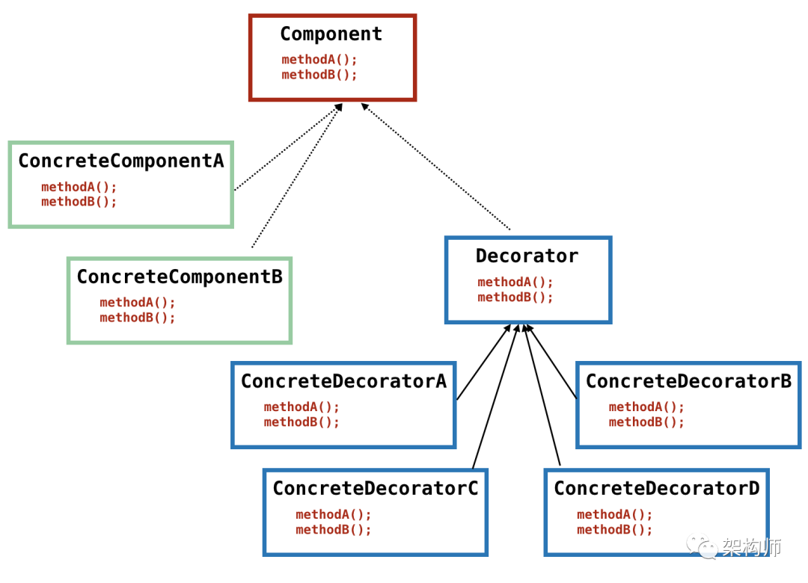

# Head First Design Pattern reading notes

`Gang of Four (GoF)`分类将设计模式分为23种经典模式，同时根据用途又可以分为**创建型模式(C)、结构型模式(S)、行为型模式(B)**三大类。

<!-- TOC -->

- [Head First Design Pattern reading notes](#head-first-design-pattern-reading-notes)
    - [Strategy (B)](#strategy-b)
    - [Observer (B)](#observer-b)
    - [Chain of Responsibility (B)](#chain-of-responsibility-b)
    - [Template (B)](#template-b)
    - [State (B)](#state-b)
    - [Factory (C)](#factory-c)
        - [简单工厂](#简单工厂)
        - [工厂方法](#工厂方法)
        - [依赖倒置原则](#依赖倒置原则)
        - [抽象工厂](#抽象工厂)
    - [Singleton (C)](#singleton-c)
        - [饿汉模式](#饿汉模式)
        - [饱汉模式](#饱汉模式)
        - [嵌套类](#嵌套类)
        - [枚举单例](#枚举单例)
    - [Builder (C)](#builder-c)
    - [Prototype (C)](#prototype-c)
    - [Proxy (S)](#proxy-s)
    - [Adapter (S)](#adapter-s)
    - [Decorator (S)](#decorator-s)
    - [Bridge (S)](#bridge-s)
    - [Facade (S)](#facade-s)
    - [Composite (S)](#composite-s)
    - [参考文献](#参考文献)

<!-- /TOC -->

## Strategy (B)

定义算法族，分别封装，让其之间可以互相替换。令算法的变化独立于使用的客户。

## Observer (B)

在对象之间建立一对多的依赖。当一个对象改变状态，依赖它的对象都会收到通知，并自动更新。

>- 实际生产过程中，观察者模式常用**消息中间件**实现；
>- 单机观察者模式建议使用**Guava**中的实现`EventBus`；
>- JDK中提供了两种实现，参考`java.util.Observable`和`java.util.Observer`。

## Chain of Responsibility (B)

责任链模式通常需要建立一个**单向链表**，仅需调用头部节点，剩余节点自动流转。

## Template (B)

抽象模板父类定义**方法执行的步骤**，由子类决定抽象方法的实现、自由覆写非抽象方法。

## State (B)

在状态模式中，类的行为**基于它的状态改变**。

## Factory (C)

所有的工厂都是用来封装对象的创建。

### 简单工厂

并非严格意义上的模式。其工厂方法常声明为静态：

**静态工厂**不需要使用创建对象的方法来实例化对象；但也不能通过**继承**来改变创建方法的行为。

### 工厂方法

定义了一个创建对象的接口，但由子类决定要实例化的类，将类的实例化推迟到子类。

### 抽象工厂

提供一个接口，用于创建相关或依赖对象的**家族**，而不需要明确指定具体类，适用存在兼容性问题的情况。

`工厂方法暗含于抽象工厂中`

- 抽象工厂的任务是定义一个负责创建**一组产品**的接口；
- 该接口内的每个方法都负责创建一个具体产品，并通过实现抽象工厂的子类来提供具体的做法；
- 创建产品的方法通常以“工厂方法”来实现。

## Singleton (C)

>单件模式确保一个类只有一个实例，并提供全局访问点。

### 饿汉模式

```java
public class Singleton1 {
    // 首先，将构造方法变成私有的
    private Singleton1() {};
    // 创建私有静态实例，这样第一次使用的时候就会进行创建
    private static Singleton instance = new Singleton1();

    // 使用这个对象都是通过这个 getInstance 来获取
    public static Singleton1 getInstance() {
        return instance;
    }
    // 瞎写一个静态方法。这里想说的是，如果我们只是要调用 Singleton.getDate(...)，
    // 本来是不想要生成 Singleton 实例的，不过没办法，已经生成了
    public static Date getDate(String mode) {return new Date();}
}
```

### 饱汉模式

```java
public class Singleton2 {
    // 首先，也是先堵死 new Singleton() 这条路,将构造方法变成私有
    private Singleton2() {}
    // a) 和饿汉模式相比，这边不需要先实例化出来，注意这里的 volatile，它是必须的
    private static volatile Singleton2 instance = null;

    private int m = 9;

    public static Singleton getInstance() {
        if (instance == null) {
            // 加锁
            synchronized (Singleton2.class) {
                // b) 这一次判断也是必须的，不然会有并发问题
                if (instance == null) {
                    instance = new Singleton2();
                }
            }
        }
        return instance;
    }
}
```

- `synchronized`关键字不加在代码块上，是为尽量减少竞态条件抢占资源的时间，防止其他线程等待
- `synchronized`后再次检查`instance == null`，是为`double check lock`。当线程T1, T2同时通过a处判空，若T1获得锁，则T2等待。T1创建对象后释放锁，若没有二次判空，T2会再次拿到锁，重新创建对象
- `volatile`关键字一方面在JVM中将所修饰变量的值及时地写到主存中，另一方面**防止指令重排序**。`instance = new Singleton()`在底层分成三条指令执行：1. 在堆上申请一块内存存放该对象，此时对象字段还是默认值；2. 设置对象值；3. 将该对象和虚拟机栈上的指针建立引用关联。若不使用`volatile`，三条指令便可能出现重排，e.g.变为顺序1-3-2。执行完步骤1-3后，此时若有线程访问该对象，判断非空后取得的对象值却仍为初始值

### 嵌套类

```java
public class Singleton3 {
    private Singleton3() {}
    // 主要是使用了 嵌套类可以访问外部类的静态属性和静态方法 的特性
    private static class Holder {
        private static Singleton3 instance = new Singleton3();
    }
    public static Singleton3 getInstance() {
        return Holder.instance;
    }
}
```

- 利用嵌套类也可以实现**在调用getInstance时再实例化对象**

### 枚举单例

```java
public enum Singleton {
    INSTANCE;

    public void doSomething(){
        //todo doSomething
    }
}
```

- 枚举类在类加载时会初始化其中的所有实例，同时JVM保证了它们不会再被实例化。Born to be singleton

注意：

1. 如果程序有多个类加载器又同时使用了单件模式，可能导致单件失效而产生多个实例。此时应自行指定同一个类加载器。

## Builder (C)

建造者模式令目标类a的构造方法私有化，同时包含一个**静态内部类**aBuilder，其中的静态方法`builder()`负责将aBuilder中设置好的属性**复制**到a中，其遵循这样的链式调用方式：

```java
Food food = new FoodBuilder().a().b().c().build(); // 不建议
Food food = Food.builder().a().b().c().build();
```

## Prototype (C)

基于一个原型实例产生新的实例，即是**克隆**。欲使用Object类中的`clone()`方法，需先实现`cloneable`接口。

>Java中的克隆是浅克隆。遇到对象引用，克隆出的对象和原对象中的引用将指向同一个对象。通常实现深克隆的方法是将对象进行序列化后，再进行反序列化。

## Proxy (S)

代理模式对客户端隐藏真实实现，由代理来负责处理客户端的所有请求（包括实例化）。本质上是**方法包装**、**方法增强**。

在Spring中，用户不定义代理类，由框架作动态代理，并将定义在`@Before`、`@After`、`@Around`中的逻辑动态添加到代理中。其实现的动态代理有两种：

1. 若目标类定义了接口，则采用**JDK动态代理**（参考java.lang.reflect.Proxy类源码）
2. 若未定义，则采用**CGLIB动态代理**

## Adapter (S)

适配器用于**适配接口**，分为默认适配器、对象适配器、类适配器三种。

适配器与目标类之间**无继承关系**。

>类适配采用继承，属于静态实现；对象适配采用组合，属于组合的动态实现

## Decorator (S)

>装饰者模式动态地将责任附加到对象上，适用于**装饰类**或**增强类**的场景。



- 装饰者和被装饰对象有相同的超类型
- 可以用一个或多个装饰者包装对象
- 装饰者可以在所委托被装饰者的行为之前与/或之后，加上自己的行为
- 对象可以在任何时候被装饰，所以可以在**运行时**动态地、不限量地装饰对象
- 装饰者模式易引起**小类爆炸**，配合工厂（factory）模式和生成器（builer）模式，能够很好地解决该问题

## Bridge (S)

抽象类中依赖接口（也即**桥梁**），实现更好的代码抽象与解耦。

>与策略模式的区别在于：后者在**类中依赖接口**，没有桥梁的一层抽象。

## Facade (S)

>**外观模式**提供了统一的高层接口以访问子系统中的接口，使其更易使用。

客户端不再关注实例化过程，直接调用门面提供的语义友好的方法。

## Composite (S)

组合模式描述具有层次结构的数据。

## Command

>**命令模式**将请求封装为对象，以便使用不同的请求、队列或者日志来参数化其他对象。

- 命令模式将发出请求的对象和执行请求的对象解耦；
- 调用者可以接受命令作为参数，甚至在运行时动态进行；
- 命令可以支持撤销；
- 宏命令是命令模式的延伸，允许一次调用多个命令。

## 原则

### 依赖倒置原则

`要依赖抽象，不要依赖具体类。`

- 变量不可以持有具体类的引用；
- 不要让类派生自具体类；
- 不要覆盖基类中已实现的方法；

不管高层或低层组件都应依赖于抽象。工厂方法是实现依赖倒置的方法之一。

### 最少知识原则

减少对象之间的交互，避免过多的类耦合在一起。

## 参考文献

1. Head First 设计模式
2. [设计模式也可以这么简单--架构师](https://mp.weixin.qq.com/s/pjQ6xqDvHHlfANUW_o2dTQ)